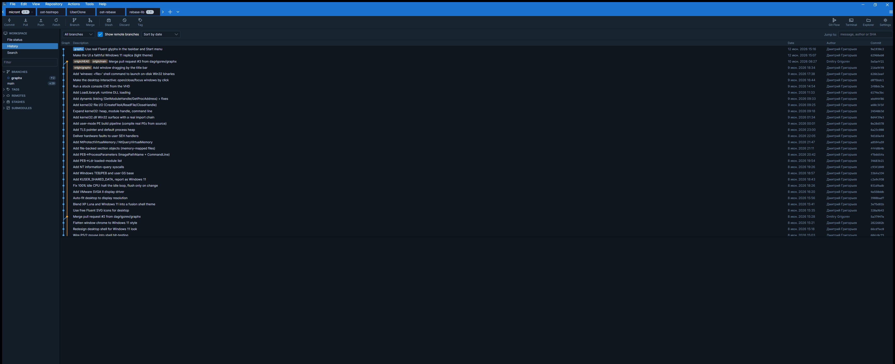
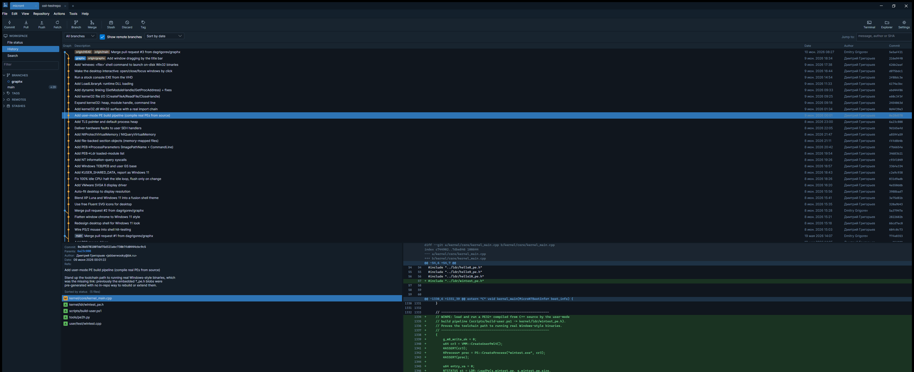
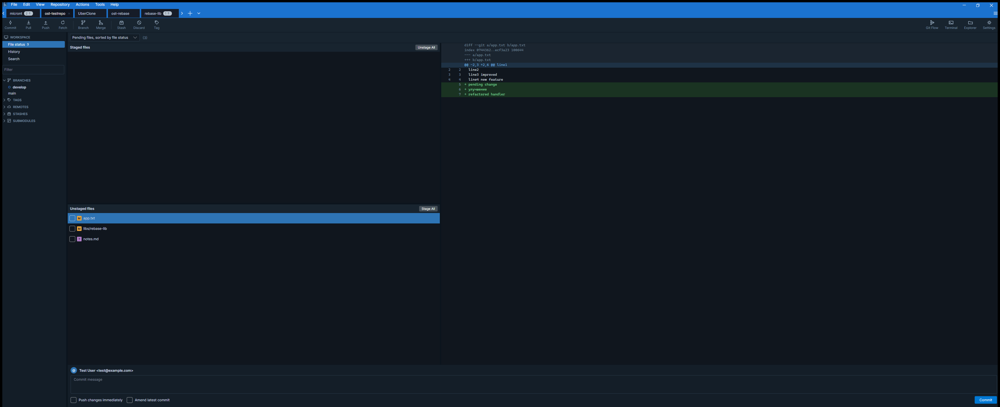
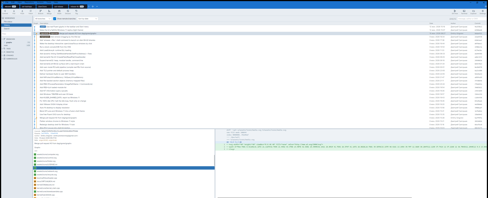
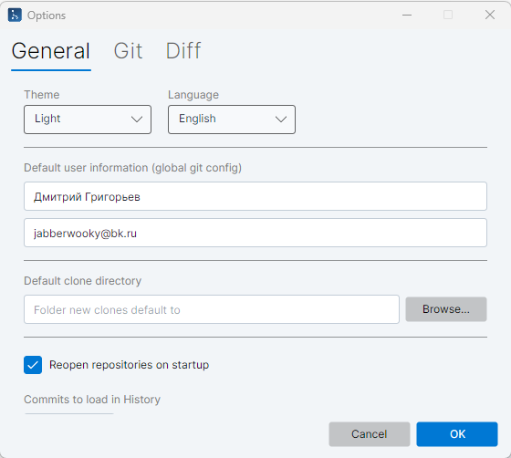

# OpenSourceTree

An open-source, cross-platform clone of [Atlassian SourceTree](https://www.sourcetreeapp.com/) built with **AvaloniaUI** (WPF-style XAML, runs on Windows / macOS / Linux), **C# / .NET 8**, **LibGit2Sharp** for local git operations and the system **git CLI** for network operations (so credential helpers and SSH agents work exactly like they do in SourceTree).



## Features

### Shell
- **Menu bar inside the window title bar**, in SourceTree's order — File, Edit, View, Repository, Actions, Tools, Help — with the repository tab strip on the row below.
- **SourceTree-style tabs** — a blue strip of rectangular tabs (dark inactive, darker active), each with a close button (shown on the active tab / on hover) and an ahead-count badge (`N ↑`). Drag to reorder, scroll arrows for overflow, a large **+** to open a tab, a **▾** to choose its kind (Local / Clone / Add / New) and a **☰** listing all open tabs. Tabs and their order persist between sessions.
- **Dark and light themes** plus an **English / Русский** interface switch (Tools → Options → General) — window colors, tinted SVG icons, diff colors and UI strings all swap live without a restart.
- **File-based SVG icons** — the original icon set lives in `Assets/Icons/*.svg`, copied next to the executable and loaded (and re-tinted per theme) from disk at runtime via Avalonia.Svg.Skia — not from embedded assembly resources.

### History & commits
- **History view** — commit log with a custom-drawn branch graph (lanes, merge edges, colored per branch), ref badges (HEAD / local / remote branches, tags), and date / author / SHA columns.
- **History filters** — all/current branch combo, *show remote branches* toggle, date/topological sort, and a *Jump to* box (message, author or SHA).
- **Commit details** — SHA, parents, author, refs, full message, changed files with status badges, and a per-file unified diff with line numbers and add/remove coloring.
- **Commit context menu** — checkout commit, tag, reset (soft / mixed / hard), interactive rebase, copy SHA.
- **Search view** — find commits by message, author or SHA.

### Working copy
- **File Status view** — staged / unstaged lists with checkbox staging, Stage All / Unstage All, per-file diff, discard, and a commit box with author line plus *amend* and *push immediately* options.
- **Pending files sorting** — by file status, path or file name, with counts.
- Auto-refresh via a filesystem watcher; F5 to refresh manually.

### Branches, tags, remotes, stashes, submodules
- **Sidebar** with SourceTree-style section icons/chevrons and a filter box: branches (current marker, ahead/behind counters), tags, remotes with their branches, stashes, and submodules.
- **Single-selection tree** — clicking a branch, tag or remote branch highlights the row, switches to History and scrolls to that ref's commit; Workspace nav items and sidebar rows share one selection.
- **Context menus** — checkout / merge / delete / copy name (branches), apply / pop / drop (stashes), open / update (submodules), and more.
- **Submodules** — double-click opens one as a tab; add-submodule dialog and init/update (single or recursive) via the git CLI.

### Git operations
- **Toolbar** — Commit, Pull, Push, Fetch, Branch, Merge, Stash, Discard, Tag, Git Flow, Terminal, Explorer, Settings.
- **Network operations** (clone / fetch / pull / push) via the git CLI with a live output window.
- **Git Flow** — initialize (production/development branches + prefixes stored in git config, compatible with the git-flow tool), start feature/release/hotfix branches, and finish them with no-fast-forward merges, version tags and branch cleanup.
- **Interactive rebase** — right-click a commit → *Rebase children interactively*: pick / reword / squash / drop and reorder in a dialog; runs as a native cherry-pick replay that automatically aborts and restores the branch on any conflict.

### New tab (Local / Remote / Clone / Add / New)
- **Local** lists known repositories with a search box, per-repo current-branch chips and an uncommitted-changes indicator (probed in the background), plus a status bar with Refresh / Show in Explorer / Open in Terminal.
- **Remote** browses **GitHub / GitLab / Bitbucket** accounts (optional personal access token or app password — without one only public repositories are listed; works with self-hosted GitLab) with search, owner avatars and private badges; double-click hands a repository to Clone. Tokens are kept in the **OS credential store** (Windows Credential Manager, macOS keychain, libsecret), never in settings.json.
- **Clone** offers URL + destination + auto-filled name with a target preview; **Add** opens an existing working copy; **New** initializes a repository.

### Settings
- **Repository settings dialog** with *Remotes* (add/edit/remove remote paths) and *Advanced* (.gitignore editing, local vs. global user identity) tabs.
- **Options dialog** (Tools → Options) with *General* (theme, language, global git identity, default clone directory, reopen-tabs-on-startup, history commit limit), *Git* (custom git executable path + detected version) and *Diff* (context lines) tabs — all persisted and applied live.

## Screenshots

**History** — commit graph, ref badges, commit details, changed files and the diff viewer:



**File status** — staged/unstaged lists with checkbox staging, per-file diff and the commit box:



**Light theme** — the same app with the light palette and tinted icons:



**Options** (Tools → Options) — theme, language, identity, clone directory, history limit, git executable, diff context:



## Building

Requirements: [.NET 8 SDK](https://dotnet.microsoft.com/download/dotnet/8.0) or newer.
For clone/fetch/pull/push a `git` executable must be on `PATH` (or set one in Tools → Options → Git).

### Quick start (any OS)

```bash
dotnet build OpenSourceTree.slnx
dotnet run --project src/OpenSourceTree
```

### Release packages

Self-contained builds (no .NET runtime needed on the target machine) land in `dist/<rid>/`.

**Windows**

```powershell
.\build.ps1                      # win-x64 -> dist\win-x64\OpenSourceTree.exe
.\build.ps1 -Runtime win-arm64   # Windows on ARM
.\build.ps1 -FrameworkDependent  # smaller output, requires installed .NET runtime
.\build.ps1 -BuildOnly           # plain build without publishing
```

**Linux / macOS**

```bash
./build.sh                # auto-detects linux-x64 / osx-x64 / osx-arm64
./build.sh linux-arm64    # explicit runtime identifier
./build.sh --build-only   # plain build without publishing
```

Cross-publishing works too — e.g. `./build.sh linux-x64` on a Windows machine produces a Linux build.

### Windows installer (MSI)

A WiX-based installer packages the self-contained build, installs to `%ProgramFiles%\OpenSourceTree`,
and adds Start Menu + Desktop shortcuts (with uninstall via Add/Remove Programs).

One-time tooling (free WiX v5 dotnet tool):

```powershell
dotnet tool install --global wix --version 5.0.2
wix extension add -g WixToolset.UI.wixext/5.0.2
```

Then build the MSI:

```powershell
.\installer\build-installer.ps1               # publishes + builds dist\OpenSourceTree-<version>-win-x64.msi
.\installer\build-installer.ps1 -SkipPublish  # reuse an existing dist\win-x64 publish
```

The installer source lives in `installer\Product.wxs`.

## Architecture

```
src/OpenSourceTree/
  Models/        plain records: commits, refs, file status, diff lines, graph rows, git-flow config, rebase steps
  Services/
    GitService       LibGit2Sharp wrapper (status, history, branches, tags, stashes, diffs, reset,
                     git-flow, interactive rebase, submodules)
    GraphBuilder     assigns commits to graph lanes, emits drawing segments per row
    GitCliService    fetch/pull/push/clone/submodule through the system git executable
    HostingService   GitHub / GitLab / Bitbucket repository listing + avatar fetch/cache
    CredentialService access-token storage in the OS credential store (+ encrypted file fallback)
    DiffParser       unified-diff text → displayable lines
    ThemeService     publishes the B.* brushes and tinted I.* icons; Dark / Light palettes
    Loc              en/ru string tables published as L.* resources for live language switching
    Ui               compact code-built modal dialogs (input, confirm, pick, output, settings, options)
    AppSettings      JSON persistence (%APPDATA%/OpenSourceTree)
    PlatformService  open terminal / file manager / SSH helpers per OS
  ViewModels/    MVVM (CommunityToolkit.Mvvm), one RepositoryViewModel per tab
  Views/         AXAML views + CommitGraphControl (custom-drawn graph cell) + Icons loader
  Assets/Icons/  original SVG icon set, copied next to the executable
```

Colors, icons and UI strings all flow through `Application.Resources` as dynamic resources
(`B.*` brushes, `I.*` icons, `L.*` strings), so theme and language changes apply live.

## Not implemented (vs. real SourceTree)

Hunk/line-level staging, file blame/log, bookmarks window, custom actions, Mercurial.
Interactive rebase is limited to linear (merge-free) ranges. Some deep dialogs
(Git Flow hub, rebase editor) are English-only. Contributions welcome.
